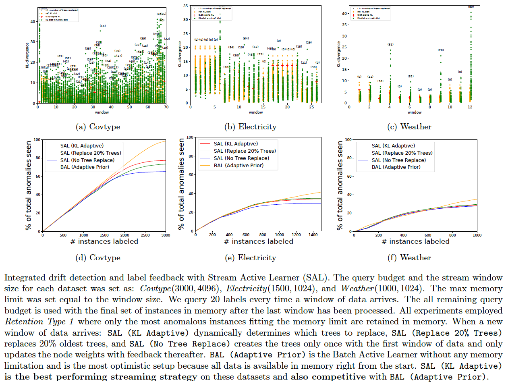

Data Drift Detection
--------------------
This section applies to isolation tree-based detectors (such as [IForest](python/aad/random_split_trees.py) and [IForestMultiview](python/aad/multiview_forest.py)) (Das, Islam, et al. 2019). Such trees provide a way to compute the KL-divergence between the data distribution of one [old] batch of data with another [new] batch. Once we determine which trees have the most significant KL-divergences w.r.t expected data distributions, we can replace them with new trees constructed from new data as follows:
  - First, partition the current window of data into two equal parts (*A* and *B*).
  - For each tree in the forest, compute average KL-divergence as follows:
    - Treat the tree as set of histogram bins
    - Compute the instance distributions with each of the data partitions *A* and *B*.
    - Compute the KL-divergence between these two distributions.
    - Do this 10 times and average.
  - We now have *T* KL divergences where *T* is the number of trees.
  - Compute the (1-alpha) quantile value where alpha=0.05 by default, and call this *KL-q*.
  - Now compute the distributions for each isolation tree with the complete window of data -- call this *P* (*P* is a set of *T* distributions) -- and set it as the baseline.
  - When a new window of data arrives replace trees as follows:
    - Compute the distribution in each isolation tree with the *entire* window of new data and call this *Q* (*Q* is a set of *T* new distributions).
    - Next, check the KL-divergences between the distributions in P and the corresponding distributions in Q. If the KL-divergence i.e., *KL(p||q)* of at least (2\*alpha\*T) trees exceed *KL-q*, then:
      - Replace all trees whose *KL(p||q)* is higher than *KL-q* with new trees created with the new data.
      - Recompute *KL-q* and the baseline distributions *P* with the new data and the updated model.
      - Retrain the weights certain number of times (determined by `N_WEIGHT_UPDATES_AFTER_STREAM` in `aad.sh`, 10 works well) with just the labeled data available so far (no additional feedback). This step helps tune the ensemble weights better after significant change to the model.

For more details on KL-divergence based data drift detection, check the [demo code](python/aad/test_concept_drift.py). Execute this code with the following sample command and see the [plots](https://github.com/shubhomoydas/ad_examples/blob/master/documentation/concept_drift/concept_drift.pdf) generated (on the *Weather* dataset):
    
    pythonw -m ad_examples.aad.test_concept_drift --debug --plot --log_file=temp/test_concept_drift.log --dataset=weather

Following shows the results of integrating drift detection along with label feedback in a streaming/limited memory setting for the three datasets (*Covtype, Electricity, Weather*) which we determined have significant drift. We used `RETENTION_TYPE=1` in `aad.sh` for all datasets. The commands for generating the discovery curves for `SAL (KL Adaptive)` are below. **These experiments will take a pretty long time to run because: (1) streaming implementation is currently not very efficient, (2) we get feedback for many iterations, and (3) we run all experiments 10 times to report an average.**

    bash ./aad.sh weather 1000 10 0.03 7 1 0 1 1024 1 1 1
    bash ./aad.sh electricity 1500 10 0.03 7 1 0 1 1024 1 1 1
    bash ./aad.sh covtype 3000 10 0.03 7 1 0 1 4096 1 1 1

**Why actively detect data drift?** This is a valid question: *why employ active drift detection if there is reason to believe that a less expensive passive approach such as always replacing a fraction of the model will work just as well?* The reason is that, in practice, analysts want to be alerted when there is a drift (maybe because other algorithms downstream have to be retrained). Only the active [drift detection] algorithms (such as *SAL (KL Adaptive)* in the plots above) offer this ability, not the passive ones (such as *SAL (Replace 20% Trees)* and *SAL (No Tree Replace)*). Active drift detection algorithms also need to be robust (low false positives/negatives) in order to be useful.

The application of KL-divergence in the **specific manner employed here is novel**, and is motivated by the dataset partitioning idea (presented in a different context) in (Dasu et al. 2006).

**Reference(s)**:
  - Das, S., Islam, R., Jayakodi, N.K. and Doppa, J.R. (2019). *Active Anomaly Detection via Ensembles: Insights, Algorithms, and Interpretability*. [(pdf)](https://arxiv.org/pdf/1901.08930.pdf)

  - Tamraparni Dasu, Shankar Krishnan, Suresh Venkatasubramanian and Ke Yi, *An information-theoretic approach to detecting changes in multi-dimensional data streams*, Symp. on the Interface of Statistics, Computing Science, and Applications, 2006 ([pdf](https://www.cse.ust.hk/~yike/datadiff/datadiff.pdf)).

Applying drift detection to tree-based classifiers
--------------------------------------------------
The above KL-divergence based method can be applied to detect drift with tree-based classifiers such as Random Forest as well. The example [python/aad/test_concept_drift_classifier.py](python/aad/test_concept_drift_classifier.py) uses the wrapper class [RandomForestAadWrapper](python/aad/classifier_trees.py) to detect the drift with trees created by `sklearn.ensemble.RandomForestClassifier`.

